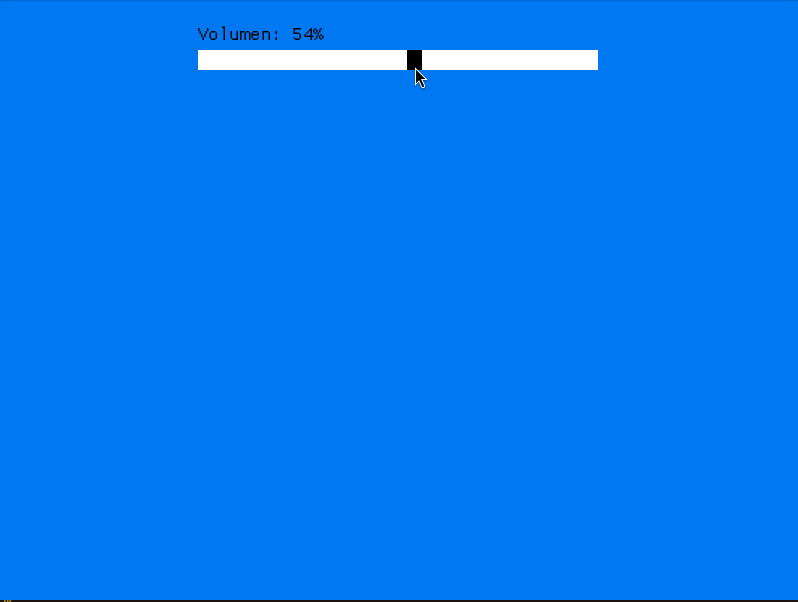

# Simple_Macroquad_Slider
  

## ¿Cual es la utilidad de este proyecto? ⁉️
Este es mi primer pequeño proyecto desarrollado en Rust, como parte de un proyecto mayor.  
El caso es que necesitaba utilizar sliders para controlar el volumen y... el que ofrece macroquad me parecio feo. Asi que si algo no te gusta... ¡crea tu propia versión!  
Aun hay mucho que pulir, poco a poco ire mejorandole conforme vaya encontrando sus limites en diferentes proyectos o si recibo algun tipo de feedback.  

## Uso  :gear:
Clona este repositorio:  
```
git clone https://github.com/HectorCRM/simple_macroquad_slider.git
```

Abre el Cargo.toml del proyecto en el que quieras utilizarlo y añade:
```
[dependencies]
Slider = { path = "/ruta del crate en tu máquina" }
```

Luego incluyelo en el proyecto:
```
use Slider::Slider;
```

Hecho esto, debes contar con una variable de tipo mut sobre la cual trabajara el slider. En el gif de ejemplo trabaja con volumen:
```
let mut volumen: f32 = 0.5; //A mitad, por ejemplo
```

Despues construimos el slider:
```
let mut slider_volumen: Slider = Slider::nuevo_slider(nombre_etiqueta, posicion_y, ancho_barra, alto, valor(volumen en este caso), color_barra, color_slider);
```
Y ya podemos usarlo:
```
slider_volumen.pintar_slider(volumen);
volumen = slider_volumen.mover_slider(volumen);
```

## Requisitos :clipboard:
 - Git
 - Linux
 - Rustc

## Mejoras futuras :rocket:
 - Crear sliders verticales.  
 - Habilitar diferentes valores(int, float...) y diferentes metricas a los sliders.  
<!--
## Versiones :pushpin:
 [Ver CHANGELOG](./CHANGELOG.md) -->

